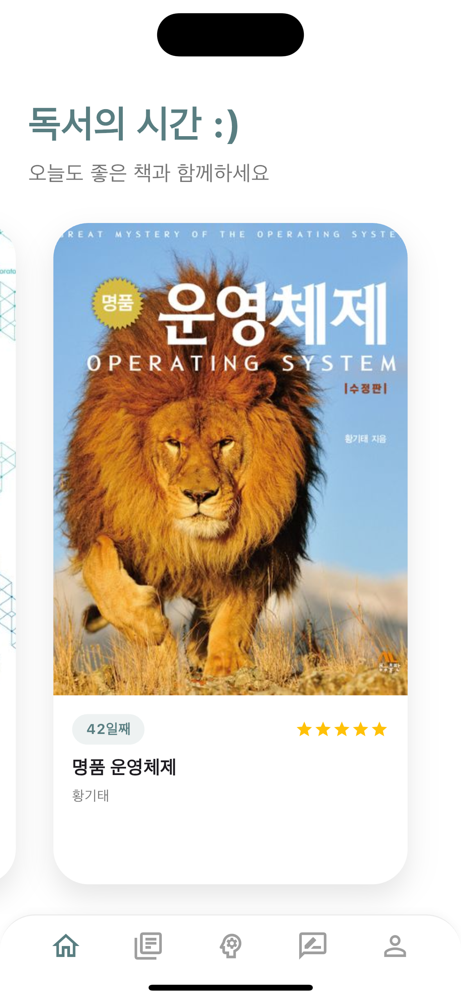
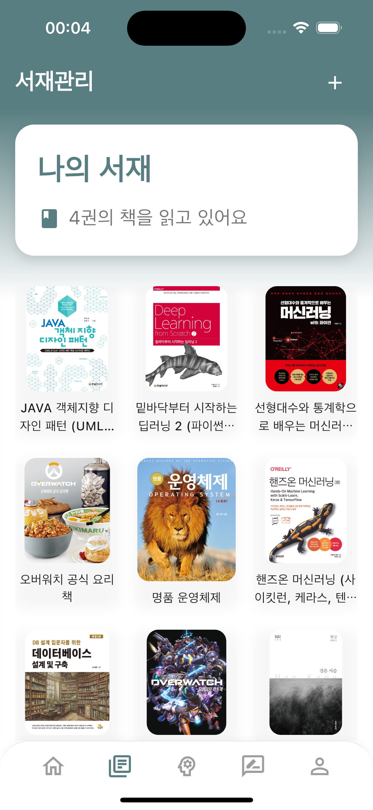
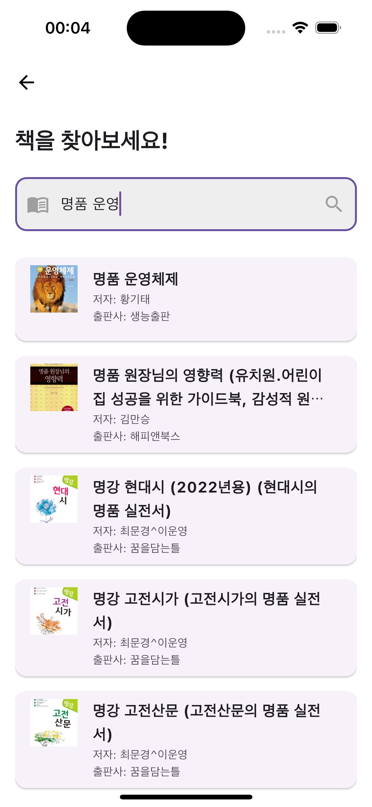
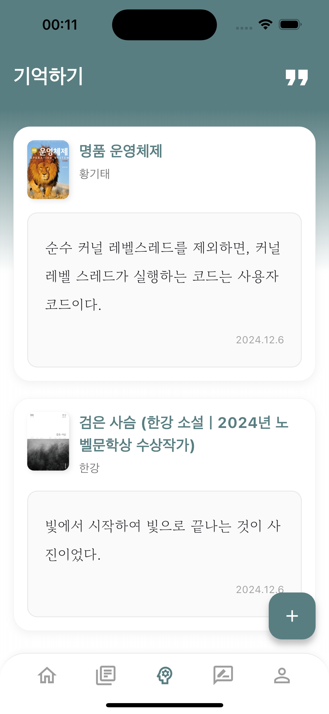
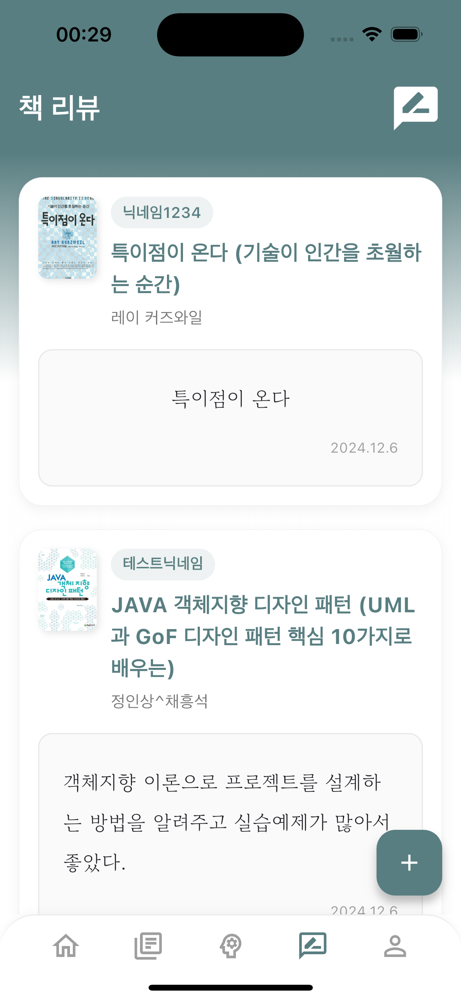
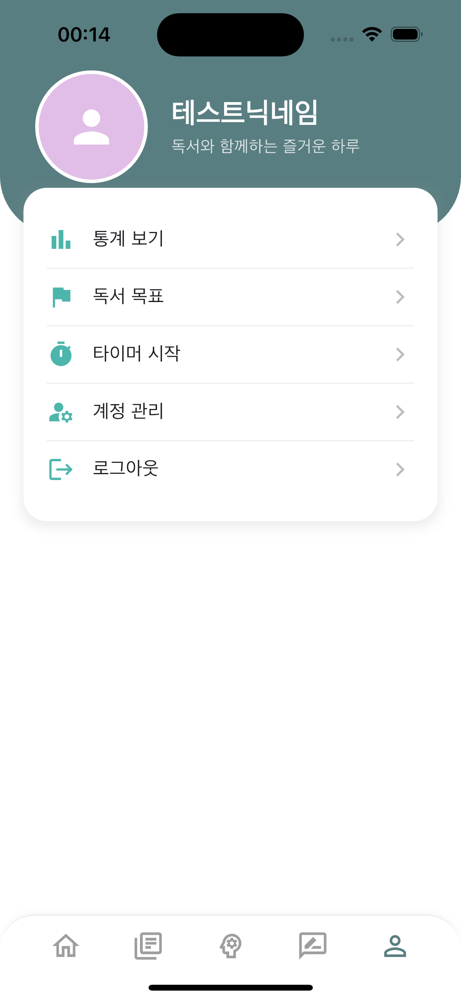
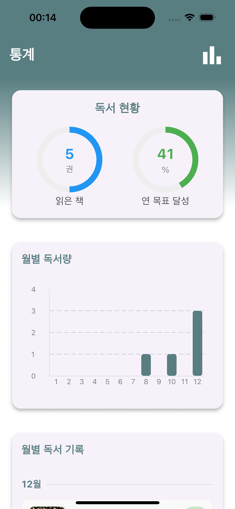
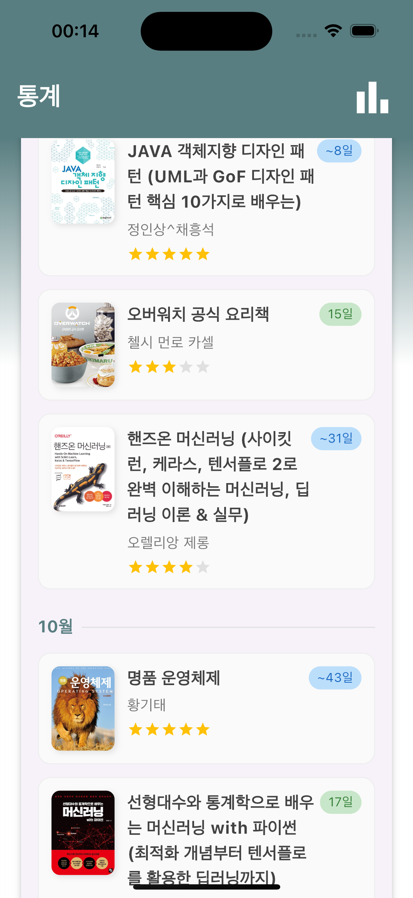

# ReadLog

독서 기록을 관리하고 공유할 수 있는 Flutter 기반 모바일 앱입니다.

## 주요 기능

- 📚 도서 검색 및 등록
- 📝 독서 기록 작성
- 🎯 독서 목표 설정 및 관리
- 💬 독서 리뷰 공유
- 📊 독서 통계 확인

## 스크린샷

<table>
  <tr>
    <td></td>
    <td></td>
    <td></td>
  </tr>
  <tr>
    <td></td>
    <td></td>
    <td></td>
  </tr>
  <tr>
    <td></td>
    <td></td>
    <td></td>
  </tr>
</table>

## 시작하기

### 필수 요구사항

- ios와 andriod 환경에서만 실행 가능
- iOS: 13.0 이상
- Android: SDK 23 (Android 6.0) 이상
- JDK: 17(JAVA_HOME 환경변수 설정 필요)

### 실행 방법

1. 저장소 클론

```bash
git clone https://github.com/kshLithium/readlog.git
```

2. 의존성 패키지 설치
```bash
flutter pub get
```

3. 앱 실행
```bash
flutter run
```

## 사용된 기술

- Flutter & Dart
- Firebase (Authentication, Firestore)
- Naver Search API
- imgBB API